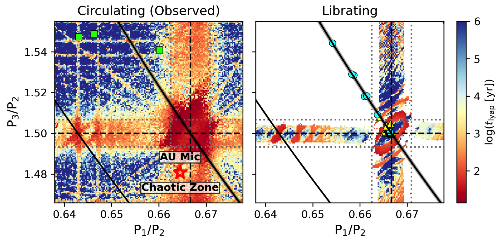
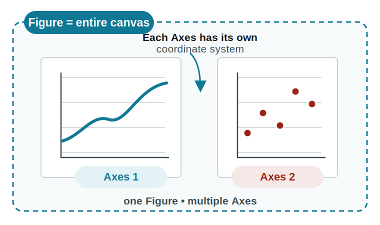
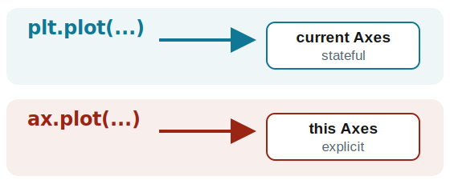
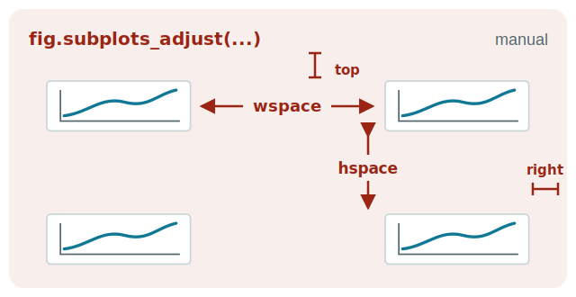
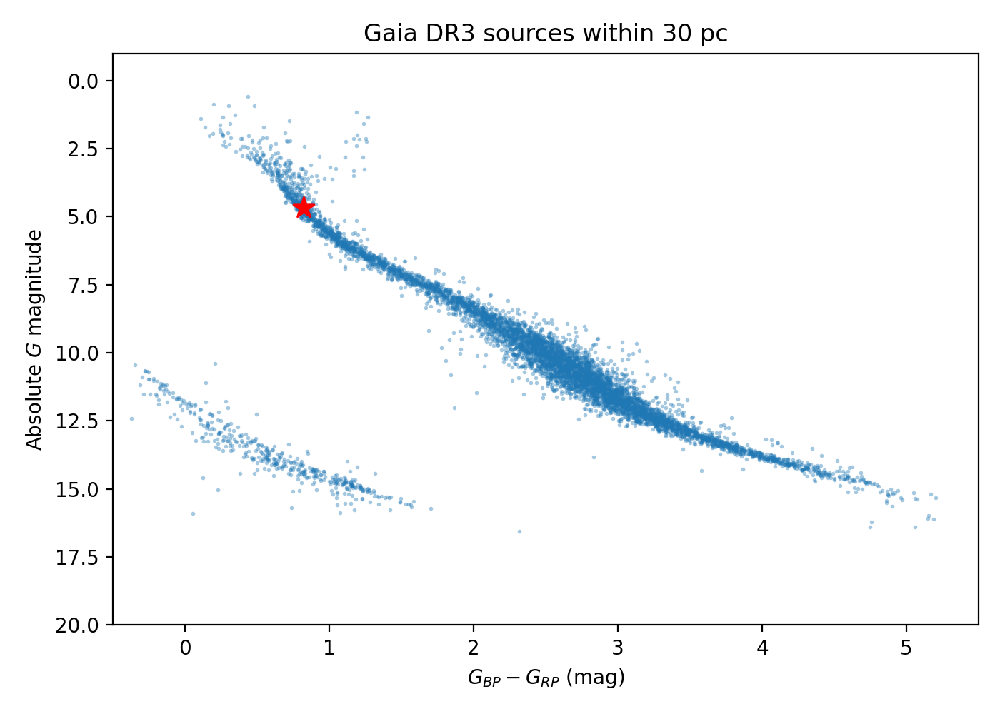

```{python}
#| echo: false
#| output: false
import numpy as np
import matplotlib.pyplot as plt

rng = np.random.default_rng(42)
```

## What is Matplotlib?

- A Python 2D plotting library that also supports 3D plots and animation
- Uses an API style similar to MATLAB
- Most of the astronomy papers today are using Matplotlib for plotting figures
- [Matplotlib Gallery](https://matplotlib.org/stable/gallery/) is a good place to find examples and inspiration.

If you have not installed Matplotlib, run `pip install matplotlib` in your terminal to install it.


{.r-stretch fig-alt="Circulating and librating orbital configurations"}

::: {.aside}
Hu et al. 2025
:::

## Your First Plot

```{python}
#| output-location: column

import numpy as np
import matplotlib.pyplot as plt

rng = np.random.default_rng(42)

x = np.linspace(0, 1, 5)
y = [3, 1, 4, 5, 2]

plt.plot(x, y)
# plt.savefig("first-plot.png", dpi=300)
# plt.savefig("first-plot.pdf")
plt.show()  # used to display the figure if running .py file.
```

Remember the name `plt` for the plotting module. It is a common convention to import `matplotlib.pyplot` as `plt`.

- In PNG format, you can specify the resolution. 300 dpi enough for publication.
- The PDF format is vectorized.
- Save the figure before calling `show()`.

## Format Strings: Colors, Line Styles, and Markers

For each line, you can specify three style components: `color`, `linestyle`, and `marker`.

:::: {.columns}
::: {.column style="width: 33%; text-align: center;"}
**Color**

| Value | Meaning |
|---|---|
| `b` | blue |
| `g` | green |
| `r` | red |
| `c` | cyan |
| `m` | magenta |
| `y` | yellow |
| `k` | black |
| `w` | white |
:::

::: {.column style="width: 33%; text-align: center;"}
**Line style**

| Value | Meaning |
|---|---|
| `-` | solid |
| `--` | dashed |
| `-.` | dash-dot |
| `:` | dotted |
:::

::: {.column style="width: 34%; text-align: center;"}
**Marker**

| Value | Meaning |
|---|---|
| `.` | point |
| `o` | circle |
| `v` | down triangle |
| `^` | up triangle |
| `s` | square |
| `p` | pentagon |
| `*` | star |
| `+` | plus |
| `x` | cross |
| `_` | horizontal line |
:::
::::

`"go-"` means green + circle + solid line. Colors also accept names or RGB arrays. See the [Matplotlib Cheatsheet](https://matplotlib.org/cheatsheets/) for more options.

## Style Multiple Curves Together

```{python}
#| output-location: column
a = np.arange(10)
plt.plot(
    a, a * 1.5, "go-",
    a, a * 2.5, "rx",
    a, a * 3.5, "*",
    a, a * 4.5, "b-.",
)
# plt.plot(a, a * 1.5, "go-")
# plt.plot(a, a * 2.5, "rx")
# plt.plot(a, a * 3.5, "*")
# plt.plot(a, a * 4.5, "b-.")
plt.show()
```

Note that `plot()` function can take multiple x-y pairs, each followed by a format string.

## Fine Control with Keyword Arguments

```{python}
#| output-location: column
x = np.linspace(0, 10, 30)
plt.plot(
    x,
    np.sin(x),
    color="green",
    linestyle=":",
    marker="p",
    markersize=10,
    markeredgecolor="black",
    markeredgewidth=2,
    markerfacecolor="red",
)
plt.show()
```

Common abbreviations: `c` for `color`, `ls` for `linestyle`, `lw` for `linewidth`, and `ms` for `markersize`.

## Axis Ranges, Labels, and Titles

```{python}
#| output-location: column
x = np.linspace(0, 10, 100)
y = np.sin(x)

plt.figure(figsize=(6, 4.5))
plt.xlim(0, 10)
plt.ylim(-1.2, 1.2)
plt.xlabel("x axis")
plt.ylabel("y = sin(x)")
plt.title("Plot of sin(x)")
plt.plot(x, y, "ro")
plt.show()
```

## Legends, Grids, and Ticks

```{python}
#| output-location: column
x = np.linspace(0, 2 * np.pi, 200)
plt.plot(x, np.sin(x), label="sin(x)")
plt.plot(x, np.cos(x), "r--", label="cos(x)")
plt.xlabel("x")
plt.ylabel("y")
plt.xlim(0, 2 * np.pi)
plt.minorticks_on()
plt.tick_params(which="both", direction="in")
plt.grid()
plt.legend()
plt.show()
```

## `annotate` and `text`: Add Annotations

```{python}
#| output-location: column
x = np.linspace(0, 10, 200)
plt.plot(x, np.sin(x), color="green")
plt.annotate(
    "First peak", 
    xy=(np.pi / 2, 1), 
    xytext=(4, 1), 
    arrowprops={"arrowstyle": "->"}
)
plt.text(7, -0.5, "sin(x) function")
plt.show()
```

`text(x, y, string)` places text; `annotate()` can also connect the text to a data position.

## Displaying International Text

Matplotlib supports Unicode, but correct rendering depends on two layers:

- **Glyph coverage:** CJK, Arabic, Devanagari, Thai, emoji, and many other scripts need fonts containing those characters.
- **Text shaping:** Arabic and Hebrew also need connected glyphs and right-to-left or bidirectional layout.

```{python}
#| eval: false
plt.rcParams["font.family"] = [
    "DejaVu Sans",
    "Noto Sans CJK SC",
    "Noto Sans Arabic",
    "Noto Sans Devanagari",
]
```

Usually no extra Python import is needed: install suitable fonts and list them as fallbacks. Matplotlib 3.11+ adds `libraqm`-based complex layout for Arabic, Hebrew, ligatures, and mixed text directions.

Reference: [Matplotlib font guide](https://matplotlib.org/stable/users/explain/text/fonts.html) · [Complex text layout in 3.11](https://matplotlib.org/stable/release/prev_whats_new/whats_new_3.11.0.html#complex-text-layout-with-libraqm)

## Matplotlib Text in Eight Writing Systems

```{python}
#| output-location: column
samples = [
    ("English", "Hello", "DejaVu Sans", "en"),
    ("Chinese", "你好", "PingFang HK", "zh"),
    ("Arabic", "مرحبًا", "Geeza Pro", "ar"),
    ("Hindi", "नमस्ते", "Kohinoor Devanagari", "hi"),
    ("Japanese", "こんにちは", "Hiragino Sans", "ja"),
    ("Korean", "안녕하세요", "Apple SD Gothic Neo", "ko"),
    ("Greek", "Γεια σας", "DejaVu Sans", "el"),
    ("Russian", "Здравствуйте", "DejaVu Sans", "ru"),
]

fig, ax = plt.subplots()
ax.set(xlim=(0, 1), ylim=(0, len(samples) + 1))
for row, (label, text, font, language) in enumerate(samples):
    y = len(samples) - row
    ax.text(0.05, y, label, va="center", color="0.35")
    ax.text(0.4, y, text, va="center", fontsize=18,
            fontfamily=font, language=language)
ax.axis("off")
plt.show()
```

`language=` and complex shaping require Matplotlib 3.11+; font names depend on what is installed locally.

# `Figure` and `Axes`

## What Makes Up a Plot?

:::: {.columns}
::: {.column width="62%"}
{width="100%" fig-alt="One Matplotlib Figure canvas containing two Axes with independent coordinate systems"}
:::

::: {.column width="38%"}
- `Figure` = the entire canvas
- `Axes` = one plotting region and coordinate system
- One `Figure` can hold many `Axes`

{width="100%" fig-alt="Pyplot targets the current Axes while an Axes method targets a named Axes explicitly"}

Use `ax.*` for multiple panels and reusable code.
:::
::::

## A 2 × 2 Grid Uses Indices 1–4

```{python}
#| output-location: column
for index in range(1, 5):
    ax = plt.subplot(2, 2, index)
    ax.text(
        0.5, 0.5, str(index),
        ha="center", va="center",
        fontsize=32, fontweight="bold",
        transform=ax.transAxes,
    )
    ax.set_xticks([])
    ax.set_yticks([])

plt.tight_layout()
plt.show()
```

Indices fill the grid from left to right, then from top to bottom.

## Create Multiple Axes with `add_subplot`

```{python}
#| output-location: column
fig = plt.figure(figsize=(8, 6))
ax1 = fig.add_subplot(2, 1, 1)
ax2 = fig.add_subplot(2, 1, 2)

x = np.linspace(0, 10, 100)
ax1.plot(x, np.sin(x), "*r")
ax2.plot(x, 1 - np.sin(x), ">g")

for ax in (ax1, ax2):
    ax.set(xlabel="x", ylabel="y = f(x)", xlim=(0, 10))
    ax.grid()

fig.tight_layout()
plt.show()
```

## `subplots` is the Shorter Form

```{python}
#| output-location: column
fig, (ax1, ax2) = plt.subplots(2, 1, figsize=(8, 6))
x = np.linspace(0, 10, 100)
ax1.plot(x, np.sin(x), "r")
ax2.plot(x, 1 - np.sin(x), "g")
fig.tight_layout()
plt.show()
```

The return values are a `Figure` and an array of `Axes`.

## Control the Spacing Between Panels

:::: {.columns}
::: {.column width="47%"}
```{python}
#| eval: false
fig.tight_layout()

fig.subplots_adjust(
    left=None, bottom=None,
    right=None, top=None,
    wspace=None, hspace=None,
)
```

`tight_layout()` measures the space needed by tick labels, axis labels, and titles, then adjusts the Axes positions to reduce overlap.

- Call it after setting labels and titles.
- Use `subplots_adjust(wspace=..., hspace=...)` for manual gaps.
:::

::: {.column width="53%"}
{width="100%" fig-alt="A two-by-two panel grid showing the outer top and right boundaries and the internal wspace and hspace controlled by subplots adjust"}
:::
::::

## `plt.axes`: Position an Axes Manually

```{python}
#| output-location: column
big_ax = plt.axes()
small_ax = plt.axes([0.25, 0.60, 0.25, 0.25])

big_ax.plot(np.arange(10) ** 2, "*--", lw=2, markersize=12)
small_ax.plot(np.arange(10) ** 2, "*--", lw=2, markersize=12)
small_ax.set_xlim(-0.5, 2.5)
small_ax.set_ylim(-0.5, 4.5)
plt.show()
```

`[left, bottom, width, height]` uses relative Figure coordinates from 0 to 1.

## One Recipe Covers Most Figures

:::: {.columns}
::: {.column width="48%"}
### Default workflow

1. Start with `plt.subplots()`.
2. Plot through `ax.*`.
3. Add labels with `ax.set()`.
4. Finish with `fig.tight_layout()`.

Use `plt.*` for quick exploration. 

Position Axes manually only for layouts that `subplots()` cannot express.
:::

::: {.column width="52%"}
```python
fig, ax = plt.subplots()

ax.plot(x, y)
ax.set(
    xlabel="x",
    ylabel="y",
    title="My Figure",
)

fig.tight_layout()
plt.show()
```
:::
::::

Then keep the visual style consistent, for example with [Science Plots](https://github.com/garrettj403/SciencePlots).

# Common Plot Types

## Scatter Plots with `scatter`

```{python}
#| output-location: column
x = np.linspace(-2, 2, 20)
y1 = x**2
y2 = 2 * y1
y3 = 2 * y2

fig, ax = plt.subplots()
ax.scatter(x, y1, marker="*", c="black", s=20)
ax.scatter(x, y2, marker="o", c="green", s=40)
ax.scatter(x, y3, marker="^", c="blue", s=60)
plt.show()
```

## Points with Error Bars: `errorbar`

```{python}
#| output-location: column
period = np.array([1.2, 2.7, 5.4, 11.2, 23.5, 48.0])
radius = np.array([1.2, 2.4, 1.8, 3.1, 2.7, 4.2])
radius_err = np.array([0.08, 0.20, 0.12, 0.25, 0.18, 0.35])

fig, ax = plt.subplots()
ax.errorbar(period, radius, yerr=radius_err,
            fmt="o", capsize=4)
ax.set(
    xscale="log",
    xlabel="Orbital period (days)",
    ylabel=r"Planet radius ($R_\oplus$)",
    title="Illustrative exoplanet measurements",
)
plt.show()
```

`yerr` gives the measurement uncertainty; use a `(2, N)` array for asymmetric lower and upper errors.

## Uncertainty Bands with `fill_between`

```{python}
#| output-location: column
x = np.linspace(0, 10, 100)
y = 0.5 * x + 1
y_err = 0.4 + 0.05 * x

fig, ax = plt.subplots()
ax.plot(x, y, color="tab:blue", label="Best-fit model")
ax.fill_between(
    x, y - y_err, y + y_err,
    color="tab:blue", alpha=0.25,
    label=r"$1\sigma$ interval",
)
ax.set(xlabel="x", ylabel="y")
ax.legend(frameon=False)
plt.show()
```

`fill_between(x, lower, upper)` shades the region between two curves.

## Histograms with `hist`

```{python}
#| output-location: column
x = rng.normal(0, 1, 1000)
y = rng.uniform(-2, -1, 1000)

fig, ax = plt.subplots()
ax.hist(x, bins=10, range=(-3, 3), alpha=0.5,
        color="green", label=r"Normal: $\mu=0,\ \sigma=1$")
ax.hist(y, bins=5, range=(-2, -1), histtype="step",
        lw=3, alpha=0.6, color="orange", label="Uniform")
ax.legend(frameon=False)
plt.show()
```

## Pie Charts with `pie`

```{python}
#| output-location: column
labels = ["dark energy", "dark matter", "baryons"]
fractions = [70, 25, 5]

fig, ax = plt.subplots()
ax.pie(
    fractions,
    labels=labels,
    startangle=90,
    autopct="%.1f%%",
    explode=[0, 0, 0.2],
)
plt.show()
```

# Two-Dimensional Plots

## `imshow`: Display a Matrix as an Image

```{python}
#| output-location: column
mat = np.arange(25).reshape(5, 5)
fig, ax = plt.subplots()
image = ax.imshow(mat, cmap="gray")
fig.colorbar(image, ax=ax)
plt.show()
```

Values in the matrix are mapped to colors.

## Grids and Two-Dimensional Functions

```{python}
#| output-location: column
x, y = np.meshgrid(
    np.linspace(0, 10, 100),
    np.linspace(0, 10, 100),
)
dense = np.sin(x**2 + y**2)
fig, ax = plt.subplots()
ax.imshow(dense, origin="lower", cmap="viridis")
plt.show()
```

`meshgrid` expands two one-dimensional coordinate axes into a regular two-dimensional grid.

## `contour`: Contour Lines

```{python}
#| output-location: column
x = np.linspace(-10, 10, 50)
y = np.linspace(-5, 5, 50)
X, Y = np.meshgrid(x, y)
Z = X**2 + Y**2

fig, ax = plt.subplots()
cs = ax.contour(
    X, Y, Z,
    levels=[5, 20, 40, 80],
    linewidths=3,
    linestyles=["-", "-", "--", ":"],
    cmap="spring",
)
ax.clabel(cs, fontsize=10)
plt.show()
```

## `contourf`: Filled Contours

```{python}
#| output-location: column
x = np.linspace(-10, 10, 50)
y = np.linspace(-5, 5, 50)
X, Y = np.meshgrid(x, y)
Z = X**2 + Y**2

fig, ax = plt.subplots()
cs = ax.contourf(X, Y, Z, cmap="spring")
fig.colorbar(cs, ax=ax)
plt.show()
```

`colorbar` shows the mapping between colors and values.

# Three-Dimensional Plots and Animation

## Three-Dimensional Scatter Plot

```{python}
#| output-location: column
from IPython.display import Video

n = 2000
x, y, z = rng.uniform(0, 1, (3, n))
r = np.sqrt(x**2 + y**2 + z**2)
inside = r < 1

fig, ax = plt.subplots(subplot_kw={"projection": "3d"})
ax.scatter(
  x[inside], y[inside], z[inside], 
  c=r[inside], cmap="spring", s=6
)
Video(
    "figures/3d-scatter-rotation.mp4",
    embed=True,
    html_attributes="controls loop muted playsinline preload=auto",
)
```

3D plots are usually interactive: rotating the view helps reveal higher-dimensional structure and geometric relationships. This standalone deck uses a prerecorded rotation.

## Three-Dimensional Surface and Projected Contours

```{python}
#| output-location: column
x = np.linspace(-5, 5, 30)
y = np.linspace(-5, 5, 30)
X, Y = np.meshgrid(x, y)
Z = X**2 + Y**2

fig, ax = plt.subplots(subplot_kw={"projection": "3d"})
ax.plot_surface(X, Y, Z, cmap="rainbow")
ax.contour(X, Y, Z, zdir="z", offset=0, cmap="rainbow")
Video("figures/3d-surface-rotation.mp4", embed=True,
      html_attributes="controls loop muted playsinline preload=auto")
```

The changing viewpoint makes the surface--contour geometry easier to inspect.

## Animation with `FuncAnimation` {.smaller}

```{python}
#| output-location: column
import matplotlib.animation as animation
from IPython.display import HTML

fig, ax = plt.subplots()
line, = ax.plot([], [], "r-")

def init():
    ax.set(xlim=(0, 2), ylim=(-1, 1))
    return (line,)

def update(frame):
    x = np.linspace(0, 2, 1000)
    y = np.sin(2 * np.pi * (x - 0.01 * frame))
    line.set_data(x, y)
    return (line,)

ani = animation.FuncAnimation(
    fig, update, frames=range(100), init_func=init, interval=100
)
html = ani.to_jshtml()
plt.close(fig)
HTML(html)
```

# How to Plot with AI Agent

## Typical Workflow to Make Plots with AI Agent

1. Work within a project folder, not in webchat interface, which contains at least three directories: `data`, `scripts`, and `figures`.
2. Write a specific prompt to describe the plot you want to make, make sure to mention the following: 
   - Where is the data source, where to place the script, and where to save the figure.
   - Which data file to read, and variables to be plotted.
   - The type of plot (e.g., line plot, scatter plot, histogram, etc.)
   - Any specific formatting or styling requirements (e.g., colors, labels, titles, etc.)
3. Check the figure generated by the AI agent. If major changes or multiple modifications are needed, you can ask the AI agent to modify the script. If only one or two minor change are needed, editing the script directly is more efficient.

## Example: Plot the Hertzsprung–Russell Diagram

- The *Gaia* satellite has measured the brightness, color, and parallax of over a billion sources.
- A Hertzsprung–Russell (H–R) diagram compares stellar color with absolute magnitude.

**Goal:** use Gaia DR3 sources within 30 pc to plot absolute $G$ magnitude against $G_{BP}-G_{RP}$ color.

### Step 1: Download a Clean Gaia DR3 Sample

[Download link for the quality-filtered 30 pc Gaia DR3 sample as CSV](https://gea.esac.esa.int/tap-server/tap/sync?REQUEST=doQuery&LANG=ADQL&FORMAT=csv&QUERY=SELECT%20source_id%2Cra%2Cdec%2Cparallax%2Cphot_g_mean_mag%2Cphot_bp_mean_mag%2Cphot_rp_mean_mag%20FROM%20gaiadr3.gaia_source%20WHERE%20parallax%20%3E%3D%201000.0%2F30.0%20AND%20parallax_over_error%20%3E%2010%20AND%20visibility_periods_used%20%3E%208%20AND%20phot_g_mean_flux_over_error%20%3E%2050%20AND%20phot_bp_mean_flux_over_error%20%3E%2020%20AND%20phot_rp_mean_flux_over_error%20%3E%2020%20AND%20phot_bp_rp_excess_factor%20%3C%201.3%2B0.06*POWER(phot_bp_mean_mag-phot_rp_mean_mag%2C2)%20AND%20phot_bp_rp_excess_factor%20%3E%201.0%2B0.015*POWER(phot_bp_mean_mag-phot_rp_mean_mag%2C2)%20AND%20astrometric_chi2_al%2F(astrometric_n_good_obs_al-5)%20%3C%201.44*GREATEST(1%2CEXP(-0.4*(phot_g_mean_mag-19.5)))%20ORDER%20BY%20parallax%20DESC)

- The distance selection is $\varpi \ge 1000/30 = 33.33$ mas.
- All other quality cuts follow [Gaia Collaboration, Babusiaux et al. (2018), Sect. 2.1](https://doi.org/10.1051/0004-6361/201832843).
- The CSV contains source ID, position, parallax, and $G$, $G_{BP}$, and $G_{RP}$ magnitudes.
- Save it as `data/gaia_dr3_30pc.csv`.

The query currently returns 6,913 pre-filtered sources, so the plotting code can focus on Matplotlib.

## Step 2: Give the Agent a Reproducible Prompt

> Read `data/gaia_dr3_30pc.csv` and make a Hertzsprung–Russell diagram. Use pandas to read the CSV file. Plot $G_{BP}-G_{RP}$ on the x-axis and absolute $G$ magnitude on the y-axis. Compute
> $$M_G = G + 5\log_{10}(\varpi)-10,$$
> where parallax $\varpi$ is in milliarcseconds. Invert the magnitude axis and use small semi-transparent points. 
> Also plot the sun's position at $G_{BP}-G_{RP}=0.82$ and $M_G=4.67$ with a red star marker.
> Save the script to `scripts/plot_gaia_hr.py` and the figure to `figures/ai-agent/gaia-hr-diagram.png`.

The prompt specifies the input, calculation, plot design, and both output paths.

## Step 3: Inspect the Script and Its Figure

:::: {.columns}
::: {.column width="48%"}
```python
import pandas as pd
import matplotlib.pyplot as plt
import numpy as np

gaia = pd.read_csv("data/gaia_dr3_30pc.csv")
color = gaia.phot_bp_mean_mag - gaia.phot_rp_mean_mag
absolute_g = (
    gaia.phot_g_mean_mag
    + 5 * np.log10(gaia.parallax) - 10
)

fig, ax = plt.subplots()
ax.scatter(color, absolute_g,
           s=4, alpha=0.4, linewidths=0)
ax.scatter(0.82, 4.67, marker="*",
           color="red", s=120, zorder=3)
ax.set(xlabel=r"$G_{BP}-G_{RP}$ (mag)",
       ylabel=r"Absolute $G$ magnitude")
ax.invert_yaxis()
```

:::

::: {.column width="52%"}
{width="100%" fig-alt="Gaia DR3 color–magnitude diagram for sources within 30 parsecs, showing the main sequence and white-dwarf sequence"}
:::
::::

## Summary: Build the Plot, Then Check It

:::: {.columns}
::: {.column width="50%"}
### Matplotlib recipe

1. Create a `Figure` and `Axes` with `plt.subplots()`.
2. Plot through `ax.*` using the plot type that matches the data.
3. Add labels, limits, legends, annotations, and colorbars.
4. Finish with `fig.tight_layout()`, then save or show the figure.
:::

::: {.column width="50%"}
### AI-agent recipe

1. Specify the input data, calculation, plot design, and output paths.
2. Ask the agent to save both the script and the figure.
3. Inspect the code and the visual result.
4. Revise the prompt for major changes; edit directly for minor ones.
:::
::::
